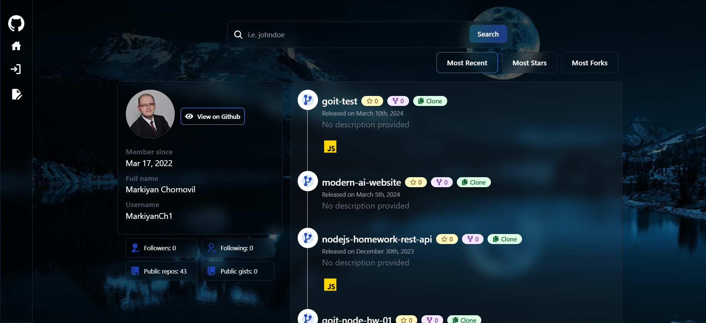

#  Github Portfolio

[](https://github.com/MarkiyanCh1/github-portfolio)

This project is new cool interactive portfolio, built with the intention of showcasing experience and skills in a captivating and engaging way. Leveraging the power of GitHub's API, it seamlessly retrieves and displays information about developer in modern stylish way. This ensures that the content you see is always up-to-date, reflecting all latest endeavors and achievements.

## 🌐 Live Website

- The application is live and hosted on Render. You can access it [here](https://github-portfolio-3gcw.onrender.com/).

## 📸 Screenshot

- Home Page  
  

## 🌟 Features

- Authentication && Authorization with Passport.js (Github Auth) 🔑
- Fetch Github User Profiles and Repos 👾
- Sort by `Most Recent`, `Most Stars`, `Most Forks` ⚙️
- Like your friends' Github and get likes from them 🧡
- Filter Repos on by Language 🚀

## 📄 Pages

1. **Home Page**: The landing page where you can see detailed information on Github user and all repos.
2. **Login Page**: The page for login with Passport.
3. **Sign-Up Page**: The page for sign up with Passport.
4. **Likes Page**: Here you can see the list on people how likeed you profile and info about them.
5. **Explore Page**: Here you can see user repos filtered by programing language.

## 🛠️ Technologies Used

- **React**: A JavaScript library for building user interfaces, used latest React 18 features.
- **React Router**: A standard routing library for React.
- **NodeJS**: A JavaScript runtime environment used to build server-side applications and APIs.
- **MongoDB**: A flexible NoSQL database that can store and manage large amounts of unstructured data.
- **Passport**: A Node.js authentication library that simplifies secure login experiences by integrating with various providers like GitHub.
- **Github API**: A powerful set of tools provided by GitHub that allows applications to interact with user data, repositories, and other functionalities programmatically.
- **TailwindCSS**: A utility-first CSS framework that provides a rapid way to style web applications.

## 🚀 Installation

To install and run this project locally on your machine, follow the steps below.

1. Clone the repository:

```bash
git clone https://github.com/MarkiyanCh1/github-portfolio.git
```

2. Navigate into the frontend directory:

```bash
cd github-portfolio/frontend
```

3. Install the client dependencies:

```bash
npm install
```

4. Build the app:

```bash
npm run build
```

5. Return to main directory:

```bash
cd ..
```

**Set Up Environment Variables**

Create a new file named `.env` in the root of your project and add the following content:

```env
PORT
MONGO_URI
GITHUB_API_KEY
GITHUB_CLIENT_ID
GITHUB_CLIENT_SECRET
CLIENT_BASE_URL
```

6. Start the app:

```bash
npm run dev
```

The application will start running on http://localhost:5000.

## 🤝 Contributing

Contributions are welcome! Please open an issue or submit a pull request.

---

## If you find this project useful, please consider giving it a star ⭐. Your support is greatly appreciated!

Happy coding! 💻
